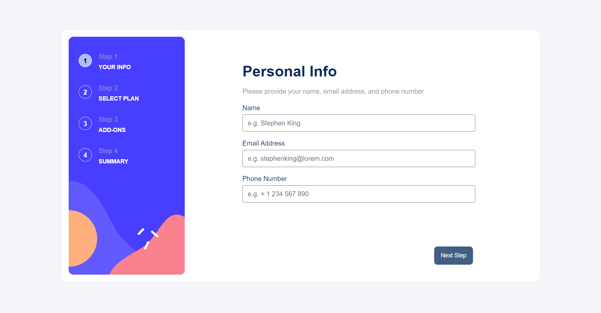

# Frontend Mentor - Multi-step form solution

This is a solution to the [Multi-step form challenge on Frontend Mentor](https://www.frontendmentor.io/challenges/multistep-form-YVAnSdqQBJ). Frontend Mentor challenges help you improve your coding skills by building realistic projects. 

## Table of contents

- [Overview](#overview)
  - [The challenge](#the-challenge)
  - [Screenshot](#screenshot)
  - [Links](#links)
- [My process](#my-process)
  - [Built with](#built-with)
  - [What I learned](#what-i-learned)
  - [Continued development](#continued-development)
  - [Useful resources](#useful-resources)
- [Author](#author)

## Overview

### The challenge

Users should be able to:

- Complete each step of the sequence
- See a summary of their selections on the final step and confirm their order
- View the optimal layout for the interface depending on their device's screen size
- See hover and focus states for all interactive elements on the page

### Screenshot



### Links

- Live Site URL: [Vercel app](https://multi-step-form-wine-omega.vercel.app/)

## My process

### Built with

- HTML 5
- Typescript
- Mobile-first workflow
- [TailwindCSS](https://tailwindcss.com/) - CSS Framework
- [TailwindCSS Forms](https://github.com/tailwindlabs/tailwindcss-forms) - CSS library for styled form selectors
- [Flowbite](https://flowbite.com/) - Styled components library
- [VueJS](https://vuejs.org/) - JS Framework

### What I learned

I mainly used this project as a way to learn the VueJS library as well as reinforcing my knowledge of TailwindCSS. I learned a lot about how Vue works and I'm able to say that it's a really good framework!

A component I'm rather proud of is the Main-View and Translated-Container component combination. I wanted to try a generic approach to how the steps were layed out and that resulted into these two components.

#### Main-View


```ts
<template>
    <div id="MainView" class="h-full w-full overflow-hidden md:w-auto md:max-h-full">
        <TranslatedContainer 
        v-if="step && !step.final.value"
        :title="contentRender[step.selectedStep.value - 1].title" 
        :subTitle="contentRender[step.selectedStep.value - 1].subTitle">
        <KeepAlive>
            <component :is="contentRender[step.selectedStep.value - 1].component" />
        </KeepAlive>
        </TranslatedContainer>
        <TranslatedContainer v-if="step && step.final.value">
            <component :is="Confirmation" />
        </TranslatedContainer>
    </div>
</template>
```

The Main-View componenent serves as a container of the TranslatedContainer-component and is responsible for defining the title, subTitle and which component that should occupy the "main" space in the TranslatedContainer component. The gain of having the setup like this is that it's quite easy to add more steps if we want to, the order is also very easy to change. The main drawback is that code-wise, it's not so pretty. Mainly because of the static declaration of components, i.e this:

```ts
const contentRender: TMainContent[]  = [
    {
        title: "Personal Info",
        subTitle: "Please provide your name, email address, and phone number",
        component: PersonaForm
    },
    {
        title: "Select your plan",
        subTitle: "You have the option of monthly or yearly billing",
        component: PlanView
    },
    {
        title: "Pick add-ons",
        subTitle: "Add-ons help enhance your gaming experience",
        component: AddonsView
    },
    {
        title: "Finishing up",
        subTitle: "Double-check everything looks OK before confirming",
        component: SummaryView
    }
];
```

---

#### Translated-Container

The translated-container component works as a generic component that accepts a title and sub-title as input while it's able to serve a component it it's main body as well. Overall this component came out super clean and pretty easy to understand and work with while it saved me a lot of time and possibility of duplicate code

```ts
<script setup lang="ts">

type TInputProps = {
    title?: string;
    subTitle?: string;
}

const props = defineProps<TInputProps>();

</script>

<template>
    <div id="TranslatedView" class="bg-white -translate-y-16 absolute rounded-lg w-fit m-4 px-2 drop-shadow-lg z-40
    md:-translate-y-0 md:block md:w-auto md:h-full md:static md:drop-shadow-none">
        <div class="w-full h-full flex flex-col p-4 mx-auto md:max-w-[75%] md:my-12 md:gap-y-4">
            <h1 class="text-marineBlue font-bold text-xl md:text-4xl">
                {{ props.title }}
            </h1>
            <p class="text-coolGray font-medium">
                {{ props.subTitle }}
            </p>
            <slot />
        </div>
    </div>
</template>
```

### Continued development

One thing I would like to improve upon is the general state management of the project. As of now everything is centered around the App.Vue file containing all the state needed for the entire project, but this makes the file very big and at the same time, hard to read. In the future I would like to put all the state-related code into it's own files, I'm most likely going to do that in a seperate repo later on when I have time.

### Useful resources

The general resources I used was mainly the [TailwindCSS Documentation](https://tailwindcss.com/docs/installation) and the [VueJS Documentation](https://vuejs.org/guide/introduction.html). Outside of these two sites was mainly StackOverflow (of course), but that was only used sometimes for questions regarding css and some state management

## Author

- Frontend Mentor - [@MartJohan](https://www.frontendmentor.io/profile/MartJohan)